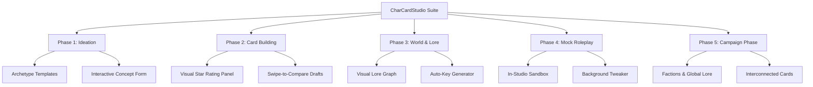

# CharCardStudio v4.0.0 — Code Audit & Future Expansion Plan

This document outlines a file-by-file code audit of the CharCardStudio extension, identifies bugs and architectural discrepancies, and provides a road map of new additions, tools, and UI/UX improvements to take the extension to the next level.

---

## Part 1: File-by-File Code Audit

A deep dive into the codebase reveals several critical bugs, architectural discrepancies, and structural logic gaps that need to be resolved to stabilize the extension.

### 1. `core/validators.js`
*   **CRITICAL BUG (Async/Sync mismatch):** `validateField()` is declared as an `async` function because it calls `countTokens()` (which is asynchronous). However:
    *   In `core/validators.js` itself, `calculateStarRating()` calls `validateField` synchronously without `await`.
    *   In `core/background.js`, `_runValidationCheck` calls `validateField` synchronously without `await`.
    *   Since `validateField` returns a `Promise`, calling it synchronously makes `result.valid` evaluate to `undefined` (which is falsy, evaluating `!result.valid` to `true`). 
    *   This causes the background checks to *always* trigger validation warnings and crash with a `TypeError` when iterating over `result.warnings` (which is `undefined`). It also penalizes the star rating calculation incorrectly, preventing cards from ever reaching 5 stars.
*   **Fix:** Refactor `validateField` to use `countTokensSync` inside the validator rules (or make it entirely synchronous by using synchronous token estimates), or update all callers to properly `await` the results.

### 2. `core/tools.js`
*   **ARCHITECTURAL DISCREPANCY (Deprecated Lorebook API):** `toolReadLoreEntries` parses the character's legacy, embedded `character_book` object (`char.data?.character_book`) rather than reading from the active named external lorebook (`session.lorebookName`).
    *   Because CharCardStudio v4.x transitioned entirely to named external lorebooks via SillyTavern's `/api/worldinfo/*` endpoints, the AI agent is completely blind to any external lorebook entries when it calls `ccs_read_lore_entries`. It will return "No lorebook entries found" even if a named lorebook is selected and populated.
*   **Fix:** Rewrite `toolReadLoreEntries` to import and call `getLorebookEntries()` from `core/lorebook.js`, keeping the agent unified with the UI.

### 3. `core/api-router.js`
*   **TYPEERROR CRASH (Non-streaming JSON response):** In `generateTextWithProfile()`, when the request is sent with `stream: false`, SillyTavern's `ConnectionManagerRequestService.sendRequest` can return a plain object containing the full response (e.g. `{ text: "..." }`) or a direct string rather than a generator.
    *   `api-router.js` attempts to iterate over the return value using `for await (const chunk of gen)`. This throws a `TypeError: gen is not iterable` if a plain object is returned, causing background calls to crash and fall back to the default profile.
*   **Fix:** Replicate the robust generator-detection logic found in `core/silent-generation.js` inside `api-router.js` before performing `for await`.

### 4. `core/session.js`
*   **LOGIC GAP (Missing Scratchpad Migration):** In `migrateSession()`, when migrating a loaded session from Version 2 to 3, the `scratchpad` field is not initialized. If a user loads an existing character session, `session.scratchpad` will remain `undefined` until they write to it, causing potential issues or console warnings during UI rendering.
*   **Fix:** Add `session.scratchpad = session.scratchpad ?? '';` to `migrateSession()`.

### 5. `core/pillars.js`
*   **INCOMPLETE SYNC (Missing Tags Mapping):** In `syncPillarsWithCard()`, the structural pillar `tags` is defined in `STRUCTURAL_PILLARS` with field name `tags`, but the `ST_TO_CCS` mapping object does not map the `tags` field.
    *   This prevents the `tags` pillar from ever auto-detecting pre-existing content, leaving it in "pending" status indefinitely even if the character card has tags filled.
*   **Fix:** Add `tags: 'tags'` to `ST_TO_CCS` mapping.

### 6. `core/lorebook.js`
*   **REVERSED RECURSION LOGIC:** In `detectRecursion()`, the dependency check is written as `other.content.toLowerCase().includes(key.toLowerCase())` (checking if another entry contains this entry's key).
    *   If entry B's content contains entry A's key, triggering entry B will inject text containing A's key, which will then trigger entry A. The activation order is B -> A. However, the code pushes `other.uid` (B) into A's trigger list, suggesting A triggers B. This reverses the dependency graph.
    *   Also, the recursion walker silently stops on cycles without flagging them to the user.
*   **Fix:** Reverse the mapping relation to correctly represent activation flow, and explicitly flag loops (A -> B -> A) as errors, since cyclical trigger chains cause heavy token inflation.

### 7. `ui/app.js` & `ui/chat.js`
*   **MINOR UI EVENT RACING:** When switching tabs inside the studio, DOM elements like suggestion chips are cleared synchronously, but agent generation can still append messages in the background, leading to minor display inconsistencies where chips reappear or get cleared mid-generation.
*   **Fix:** Wrap DOM updates in an active state check or disable input UI elements completely during background generation.

---

## Part 2: Future Additions, Ideas & Suggestions

To elevate CharCardStudio from a simple field builder into a comprehensive character development suite, we propose the following expansion phases, tools, and UI improvements.

### 1. Phase 1: Ideation (Concept Phase)
The current ideation phase relies entirely on free-form chat. While flexible, it lacks structure for creators who don't know where to start.
*   **Archetype Templates:** Inject quick-start templates (e.g. *The Grumpy Mentor*, *The Chaotic Trickster*, *RPG Boss*) that prepopulate initial pillar concepts.
*   **Interactive Questionnaire:** A mini-wizard that asks 5-6 guiding questions (e.g., "What is their primary motivation?", "What secret do they hide?") and passes the answers to the AI to draft a coherent character framework.
*   **Visual Personality Matrix:** A radar/spider chart showing traits (e.g., Introverted vs Extroverted, Logical vs Emotional) that the user can drag to define character temperament, generating corresponding personality prompts.

### 2. Phase 2: Card Building Phase
This is the core of the studio, but its UI/UX can feel disconnected from the final result.
*   **Real-time Token Budget Visualizer:** A segmented progress bar showing how much of the context window is consumed by Description, Personality, Scenario, and Lorebook entries. Warns when the character will overflow standard LLM context.
*   **Swipe-to-Compare Drafts UI:** Instead of a simple dropdown for versions, present draft options as side-by-side card previews, allowing the user to select the best traits or merge two versions together.
*   **Visual Star Rating Panel:** Expand the star rating system into a clickable dashboard. Users can click on a "half-star" deduction to immediately see what's wrong (e.g. "Missing Example Messages") and click "AI Fix" to resolve it.

### 3. Phase 3: Lore & Worldbuilding Phase
Lorebook management is currently a flat list of entries. Large lorebooks quickly become unmanageable.
*   **Visual Lore Graph:** A node graph showing how lore entries link to each other via trigger keywords. If Entry A triggers Entry B, draw an arrow. This makes recursion chains and orphaned entries immediately visible.
*   **Semantic Category Folders:** Allow users to group lorebook entries into virtual folders (e.g., *Factions*, *Geography*, *Magic System*) that translate to SillyTavern entry groups.
*   **Auto-Key Generator:** A tool that reads a lore entry's content and automatically suggests trigger keywords based on key nouns, preventing the user from manually guessing triggers.

### 4. Phase 4: Mock Roleplay (Test Phase)
*   **Concept:** A sandbox testing phase that occurs after the card is built but before final export.
*   **Implementation:** The agent temporarily switches contexts to *act* as the newly created character. The user can chat with the character to test their personality, first message, and scenario. An AI assistant monitors the chat in the background and suggests tweaks to the card based on where the character breaks character or struggles.
*   **Benefit:** Currently, users have to leave the Studio to test the card. Bringing testing into the Studio streamlines the iterative process.

### 5. Phase 5: Worldbuilding & Factions (Campaign Phase)
*   **Concept:** Expanding the studio from creating *single characters* to creating *entire campaigns*.
*   **Implementation:** A new tab specifically for Worldbuilding that maps out Factions, global Lorebooks, and interconnects multiple character cards. 
*   **Benefit:** Perfect for users creating RPG campaigns or multi-character scenarios.

### 6. Recommended Tool Additions
To make the AI agent more autonomous and helpful, we should introduce these tools:
*   `ccs_suggest_keywords(content)`: Asks the AI to analyze an entry and return a list of optimal trigger keys.
*   `ccs_optimize_tokens(field, target_tokens)`: Instructs the AI to rewrite a field (like Description) to compress it under a specific token count while retaining all semantic facts.
*   `ccs_generate_alt_greetings(count)`: Stages multiple alternate greeting drafts at once, allowing the AI to brainstorm opening scenarios.
*   `ccs_semantic_search(query)`: Lets the AI scan all fields and lorebook entries for a concept, resolving conflicts or compiling background information across files.
*   `ccs_search_web(query)`: Allow the AI to query a search endpoint to pull accurate historical details, slang, or technical jargon to inject into the character's background and lorebook (e.g., "1920s Noir Detective" terms).
*   `ccs_generate_avatar(prompt)`: Hook into SillyTavern's existing Stable Diffusion / DALL-E integration so the agent can write an optimized prompt and generate an avatar in-studio.
*   `ccs_analyze_chat_logs(messages)`: A tool that allows the agent to read the last 50-100 messages of a chat, summarize character growth, and automatically update card fields to reflect the evolved state.

---

## Part 3: General UI/UX Enhancements & Workflow Improvements

*   **Interactive Diff Viewer for Drafts:** Implement a visual green/red side-by-side diff (using a library like `diff-match-patch`) inside the Draft review panel so users can clearly see exactly what the AI changed before approving.
*   **Node-Based Relationship Graph:** In the Concept Tab, implement a visual drag-and-drop node graph (like Obsidian's graph view) showing the main character in the center and connecting them to factions, NPCs, and locations.
*   **Dynamic Theme Syncing:** Read SillyTavern's active CSS variables (`--bg-color`, `--text-color`, `--accent-color`) and dynamically adapt the Studio's color palette to match the user's custom ST theme, ensuring native-feeling integration.
*   **Contextual Inline "Ask AI" Highlighting:** Allow users to highlight a specific sentence in the Card Tab (e.g., inside the Scenario field), right-click, and select "Ask AI to rewrite this sentence to be more ominous." The AI would receive only that snippet and replace it contextually.
*   **Integrated Theme Selector:** Support for glassmorphism, dark/light mode toggle, and custom highlight colors to match the user's SillyTavern client theme.
*   **Inline Context Tooltips:** Hovering over a card field shows a quick explanation of what it does and best-practice tips (e.g., hovering over *Scenario* warns: "Do not describe user actions here").
*   **Split-Screen Workspace:** Allow the user to keep the chat open on the left and a full-page live editor on the right, removing the need to click "Edit" panels in rows.
*   **Export/Backup Manager:** Let users export/import the CharCardStudio session state separately as a JSON file, securing historical drafts and custom pillars even if the character is deleted in SillyTavern.

---

## Part 4: Conclusion on Ideation & Building Flow

The current flow (Ideate -> Build -> Lore -> Audit) is extremely logical and mirrors professional writing workflows. The Ideate phase's "Concept Paths" successfully lower the barrier to entry for users experiencing blank-page syndrome. The architecture is sound; future iterations should focus purely on expanding capabilities (images, web search) and visual flair (diffs, graphs).
