# CharCardStudio — Master Roadmap & Implementation Plan

> **Note:** This file is the single source of truth for all future development. It merges and supersedes `Plan.md` (v4.0.0 audit) and `comprehensive_expansion_plan.md`. All previously documented bugs have been resolved. Work items are organized by priority — tackle them in order from top to bottom.

---

## 📚 Resources & References

### Codebase References
- **v6 Preset (Gold Standard):** `D:\Development Folder\SillyTavern Stuff\CharCardStudio\CharCardStudio\Character_Creator_Assistant_v6.json`
- **ST Docs:** `D:\Development Folder\SillyTavern Stuff\CharCardStudio\CharCardStudio\SillyTavernDocs`
- **Reference Extension Analysis:** `D:\Development Folder\SillyTavern Stuff\Studio\EXTENSION_ANALYSIS.md`
- **Reference Extensions Doc:** `D:\Development Folder\SillyTavern Stuff\Studio\REFERENCE_EXTENSIONS.md`
- **Old Studio (UI inspiration only):** `D:\Development Folder\SillyTavern Stuff\OLDSTUDIO`

### Reference Extensions (GitHub)
- **Saints-Silly-Extensions** — Best architecture: modular, `Promise.race` cancellation, streaming: https://github.com/Saintshroomie/Saints-Silly-Extensions
- **ST-Copilot** — Best UI/features: floating window, lorebook management, diff engine, ConnectionManagerRequestService: https://github.com/Supker/ST-Copilot
- **Lorewalker** — Lorebook-focused patterns: https://github.com/Rukongai/Lorewalker
- **CardGenV2** — Anti-pattern reference (standalone app, don't copy): https://github.com/zebede1980/CardGenV2
- **World-Forge** — ST JSON internals docs, multi-phase pipeline design: https://github.com/AndreiNicu/World-Forge
- **Agents Are Thinking** — Agentic tool calling patterns: https://github.com/czl9707/agents-are-thinking

### Key Patterns to Adopt (from Reference Analysis)
1. **Saints' `Promise.race` abort pattern** — for all cancellable background generation
2. **ST-Copilot's `ConnectionManagerRequestService`** — for utility/alternate API profile support
3. **ST-Copilot's JSON-block fallback** — for non-tool-calling API backends
4. **ST-Copilot's diff engine** — for staged draft comparison (LCS-based, ~150 lines)
5. **World-Forge's multi-phase pipeline** — with explicit user approval gates between phases

---

## 🗺️ Visual Architecture Roadmap

```mermaid
graph TD
    A[CharCardStudio Suite] --> P1[Priority 1: Quick Wins]
    A --> P2[Priority 2: Core Improvements]
    A --> P3[Priority 3: New Features]
    A --> P4[Priority 4: Major Systems]

    P1 --> P1a[Prompt Enrichment v6 Alignment]
    P1 --> P1b[Token Budget Visualizer]
    P1 --> P1c[Scorecard AI Fix Buttons]
    P1 --> P1d[Dynamic Theme Sync]

    P2 --> P2a[Concept Brief System]
    P2 --> P2b[New Tools: optimize / alt-greetings / semantic-search]
    P2 --> P2c[Lore Category Folders]
    P2 --> P2d[Lorebook Context Injection]

    P3 --> P3a[Visual Lore Graph]
    P3 --> P3b[Personality Radar Chart]
    P3 --> P3c[Contextual Inline Ask AI]
    P3 --> P3d[Split-Screen Workspace]

    P4 --> P4a[World / Campaign Mode]
    P4 --> P4b[Avatar Generation Hook]
    P4 --> P4c[Chat Log Analysis Tool]
```



---

## ✅ Completed / Already Implemented

These items were in the original plan but are confirmed done in the current codebase:

- [x] **Async/sync validator fix** — `validateField()` is now synchronous
- [x] **Lorebook API fix** — `toolReadLoreEntries` uses `getLorebookEntries()` from `lorebook.js`
- [x] **API router crash fix** — generator-detection logic is robust with non-streaming fallbacks
- [x] **Scratchpad session migration** — `session.scratchpad` initialized in v3 migration
- [x] **AI Scorecard** — `ccs_submit_review` tool + Concept Panel scorecard UI with progress bars, strengths/weaknesses accordion
- [x] **Draft versioning** — `draft.versions[]` with version navigation (swipe-to-compare data layer exists)
- [x] **Field version history + diff** — `field-history.js` + `buildFieldDiffHtml()` 
- [x] **Pillar system** — Structural + World pillars, progress tracking, `syncPillarsWithCard()`
- [x] **Multi-tab lock** — Prevents session conflicts
- [x] **Mode histories** — Per-mode isolated chat histories (Studio, Janitor, HTML, etc.)
- [x] **Background checks** — Conflict detection, token checks, validation
- [x] **Coherence Audit** — `runCoherenceAudit()` with modal report

---

## 🔥 Priority 1 — Quick Wins (High Impact, Low Effort)

These are the most impactful changes that require the least architectural work. Do these first.

---

### 1.1 — Prompt Enrichment: v6 Alignment

**Files:** `prompts/identity.js`, `prompts/phase-instructions.js`

**Problem:** The current system prompts are well-structured but abbreviated. The Ideate phase prompt is a sparse list of DOs and DON'Ts with no card type definitions, no rich behavioral guidance, and no deep integration with the v6 preset's creative logic.

**What's already good:**
- Banned names list ✅
- Prose 5-paragraph structure ✅
- PList notation ✅
- Flipped Scenario technique ✅
- Naming rules by world type ✅

**What's missing:**

1. **Card type definitions** — The v6 preset distinguishes multiple card types. The Ideate prompt should define them so the AI knows what it can build:
   - **Type A: Single Character** — Standard waifu/companion/antagonist card
   - **Type B: Scenario/Situation** — Card centers on a setup, not a person (e.g., "You wake up in a spaceship")
   - **Type C: Multi-Character Cast** — Multiple named characters in one card
   - **Type D: RPG/Quest** — Structured quest/adventure card with mechanics
   - **Type E: World/Lorebook** — No character at all — just world lore (relevant for Campaign Mode later)

2. **Richer ideation behavioral guidance** — The Ideate phase should tell the AI to:
   - Explicitly identify the card type early in conversation
   - Propose a "character DNA" snapshot (3-4 sentences: hook, core trait, dark side, relationship role)
   - Suggest 2-3 different "directions" the concept could go before committing
   - Not move to Build until the user has approved a direction

3. **Platform differentiation** — JanitorAI cards have different rules (PList at bottom of Scenario, no `{{user}}` lines in mes_example). The session should track target platform and the build prompt should adapt.

4. **PList clarification** — PList is **optional and secondary**, not the default. The prompt should be clear that Prose is the default and PList is only used when the user explicitly requests it or for smaller/older models.

**Implementation:**
- Add card type enum to session state
- Enrich `PHASE_PROMPTS.ideate` with the above behavioral rules
- Add platform field (`sillyTavern | janitorai`) to session, with JanitorAI-specific build instructions

---

### 1.2 — Token Budget Visualizer

**Files:** `ui/app.js` (`_renderCardTab()`), `style.css`

**Problem:** Token counts exist per-field but there's no at-a-glance overview of the card's total token footprint with visual warnings.

**What to build:**
- A segmented horizontal bar at the top of the Card Tab
- Each segment represents a field group, colored differently:
  - 🔵 Description + Personality
  - 🟢 Scenario + First Message
  - 🟡 Example Messages + System Prompt
  - 🟠 Lorebook entries (from `getLorebookTokenBudget()`)
  - ⚪ Other (Creator Notes, Character Note, Alt Greetings)
- **Warning threshold:** Configurable in settings, defaulting to **3,000 tokens** (user note: cards go up to 3-4k, so warning should start at ~3k, not 1.5-2k as originally planned)
- Color changes: green → amber → red as total approaches threshold

**Session integration:** The lorebook token count is already available via `getLorebookTokenBudget()`. Field token counts are already being calculated in `_renderCardTab()`.

---

### 1.3 — Scorecard "AI Fix" Buttons

**Files:** `ui/app.js` (`_renderConceptTab()`, scorecard section)

**Problem:** The AI Scorecard shows category scores (e.g., "Voice & Tone: 3/5") but clicking them does nothing.

**What to build:**
- Make each scorecard category bar clickable
- On click: switch to the Chat panel and call `sendMessage()` with a targeted repair prompt, e.g.:
  > *"The AI review gave Voice & Tone 3/5. Looking at the First Message and Example Messages, please rewrite them to give the character a more distinct speech pattern and unique verbal mannerisms."*
- The prompt should be constructed dynamically from the category name, score, and any weakness text from the scorecard

**Extra:** Add a "Regenerate Review" button to the scorecard header that calls `triggerAIReview()` again.

---

### 1.4 — Dynamic Theme Sync

**Files:** `style.css`, `ui/app.js`

**Problem:** The extension uses hardcoded `--ccs-*` CSS variables that don't adapt to the user's SillyTavern theme, making it look foreign.

**What to build:**
- On `openStudio()`, read SillyTavern's active CSS custom properties:
  - `--SmartThemeBodyColor` → map to `--ccs-bg-primary`
  - `--SmartThemeBlurTintColor` → map to `--ccs-bg-secondary`
  - `--SmartThemeBodyColor` variations → other bg levels
  - `--SmartThemeFontColor` → map to `--ccs-text-primary`
  - `--SmartThemeEmColor` → map to `--ccs-accent`
- Apply them to the `#ccs_window` element via `element.style.setProperty()`
- Add a settings toggle: "Sync with SillyTavern Theme" (default: on)
- If toggled off, use CCS's built-in dark theme

---

## 🧠 Priority 2 — Core Improvements (Medium Effort, High Value)

---

### 2.1 — Concept Brief System (Agentic Ideation Artifact)

**Files:** `core/session.js`, `ui/app.js`, `prompts/phase-instructions.js`, `core/tools.js`

**Background:** The user's idea — inspired by how Antigravity's IDE creates living plan documents that the user can comment on — is to give the AI a structured document it writes to during ideation, which the user can annotate. This replaces the questionnaire concept entirely.

**How it works:**
1. During the Ideate phase, the AI can call a new tool `ccs_write_brief(content)` to write/update a structured Concept Brief document
2. The brief is stored in `session.conceptBrief` (string, markdown)
3. It's rendered in a new "Brief" sub-panel in the Concept Tab — a rich text area the user can directly annotate
4. User can add `<!-- note: make her darker -->` style inline comments
5. When the user sends a follow-up message, the brief (with annotations) is injected into context
6. The AI reads the annotations and refines its proposals
7. Once the concept is approved, the AI populates pillars from the brief

**Brief format (AI writes this):**
```markdown
## Character Concept Brief

**Working Title:** [Name or concept placeholder]
**Card Type:** [Type A/B/C/D/E]
**Genre/Tone:** [e.g., Dark Fantasy, Slice of Life, Sci-Fi Horror]

### Core Identity
[1-2 sentences: the essence of who they are]

### Hook
[What makes a stranger want to play this character immediately?]

### Appearance
[Key visual traits — NOT a full description yet, just anchors]

### Personality Directions
[2-3 possible interpretations of the character, user picks/merges]

### Dark Side / Cost
[What does their strongest trait cost them?]

### Open Questions
[Things the AI needs to know before building — numbered list]
```

**New tool to add:**
```javascript
// ccs_write_brief(content) — writes/updates the concept brief
// ccs_read_brief() — reads it back for context injection
```

**Does this conflict with pillars?** No. The brief is created during Ideation. Once the user approves a direction, the AI calls `ccs_update_pillar` to create structural pillars based on the brief. The brief then becomes a reference document, not an active editing surface.

---

### 2.2 — New Tool: `ccs_optimize_tokens`

**Files:** `core/tools.js`, `prompts/phase-instructions.js`

**What it does:** AI rewrites a card field to compress it under a target token count while retaining all semantic facts.

```javascript
// Tool parameters:
{
  field: 'description',      // Which field to compress
  target_tokens: 600,        // Target token budget
  preserve_plist: true        // Keep PList notation intact if present
}
```

**Flow:**
1. AI calls `ccs_read_field` to get current content
2. AI calls `ccs_optimize_tokens` with the rewrite
3. This internally calls `ccs_write_field` to stage a draft for approval
4. The result message tells the user: "Compressed description from 847t → 592t. Waiting for approval."

---

### 2.3 — New Tool: `ccs_generate_alt_greetings`

**Files:** `core/tools.js`, `prompts/phase-instructions.js`

**What it does:** Generates multiple alternate greeting drafts in parallel, each staging a different opening scenario.

```javascript
// Tool parameters:
{
  count: 3,          // How many greetings to generate
  themes: ['morning', 'conflict', 'mystery']  // Optional tone hints per greeting
}
```

**Flow:** AI generates `count` alternate greetings and calls `ccs_write_field` for each (`greeting_index: 0`, `greeting_index: 1`, etc.). User can apply or skip each independently.

---

### 2.4 — New Tool: `ccs_semantic_search`

**Files:** `core/tools.js`, `prompts/phase-instructions.js`

**What it does:** Scans all card fields + lorebook entries for a concept or keyword, returning matches. Lets the AI resolve contradictions or compile background facts before writing.

```javascript
// Tool parameters:
{
  query: 'sword fighting'   // Natural language or keyword
}
```

**Implementation:** Pure JS — reads all fields from `ctx.getCharacterCardFields()` and lorebook entries from `getLorebookEntries()`, does case-insensitive substring search, returns matching excerpts. No API call needed.

---

### 2.5 — Lore Tab: AI-Driven Category Folders

**Files:** `ui/app.js` (`_renderLoreTab()`), `core/lorebook.js`

**Problem:** The Lore Tab is a flat list. Large lorebooks become unmanageable.

**What to build:**
- The `category` field already exists in `ccs_create_lore_entry` — the AI already assigns categories
- Group lore entries in the UI into expandable folder-style accordions by category
- Categories: Geography, Factions, NPCs, Magic System, Items, History, Culture, Rules (Constant)
- Entries without a category go into an "Uncategorized" folder
- Each folder shows entry count badge + can be collapsed/expanded
- The AI is instructed in the Lore phase prompt to **always assign a category** when creating entries

---

### 2.6 — Lorebook Context Injection

**Files:** `prompts/phase-instructions.js`, `core/session.js`

**Problem:** The AI doesn't know what's already in the lorebook unless it explicitly calls `ccs_read_lore_entries`. For large lorebooks, this burns tokens. For small ones, it should happen automatically.

**What to build:**
- In `buildSystemPrompt()`, if a lorebook is selected (`session.lorebookName`) and has ≤ 20 entries, auto-inject a compact lorebook summary into the system prompt:
  ```
  ━━━ CURRENT LOREBOOK SUMMARY ━━━
  Selected: "World of Aethoria" (12 entries)
  • [Geography] Neo-Tokyo (keys: neo-tokyo, city)
  • [Factions] Iron Circle (keys: iron circle, faction)
  ...
  Use ccs_read_lore_entries for full content.
  ```
- If > 20 entries, just inject the count and category breakdown — don't list all entries

---

## 🌐 Priority 3 — New Features (Significant Effort, High Value)

---

### 3.1 — Visual Lore Graph

**Files:** New `ui/lore-graph.js`, `ui/app.js`, `style.css`

**Background:** An interactive node graph (like Obsidian's graph view) showing how lorebook entries link to each other via trigger keywords.

**How it works:**
- Nodes = lorebook entries (colored by category)
- Edges = keyword overlaps (Entry A's content contains Entry B's key → draw arrow A→B)
- Instantly reveals: orphaned entries (no connections), recursion loops (A→B→A), and clusters
- Clicking a node opens the entry detail

**Technical approach:**
- Lightweight custom SVG force-directed graph (no D3.js — too heavy)
- Physics: simple spring simulation (repulsion between nodes + attraction along edges)
- Rendered into a `<svg>` element inside the Lore Tab
- Toggle button: "List View" ↔ "Graph View"

**Why valuable:** Makes recursion loops (`detectRecursion()` already flags these) instantly *visible* instead of just logged. Orphaned entries become obvious at a glance.

---

### 3.2 — Visual Personality Radar Chart

**Files:** New `ui/personality-radar.js`, `ui/app.js`, `core/session.js`, `style.css`

**What to build:**
- A small SVG radar/spider chart in the Concept Tab (collapsible, hidden by default)
- 6 axes: Introvert↔Extrovert, Logical↔Emotional, Chaotic↔Orderly, Gentle↔Aggressive, Serious↔Playful, Secretive↔Open
- User drags nodes to set values (0-100 per axis)
- Values stored in `session.personalityMatrix` (object: `{introvert: 70, logical: 40, ...}`)
- A "Generate from Matrix" button: sends the matrix values to the AI as context to draft a personality paragraph that reflects the settings

---

### 3.3 — Contextual Inline "Ask AI" (Text Selection Rewrite)

**Files:** `ui/app.js` (card tab field handling), `ui/chat.js`

**What to build:**
- In the card field full-content view (expand a field), user can select text
- A floating mini-toolbar appears near the selection with options:
  - ✏️ "Rewrite" — sends only the selected sentence(s) to the AI for refinement
  - 🔊 "Make more dramatic"
  - ✂️ "Condense"
  - 💬 "Custom..." — opens a small input for custom instruction
- The AI receives: [selected text] + [instruction] + [field context]
- Returns a rewrite which is diffed against the original and staged as a draft for just that snippet

**Mobile caveat:** Selection API is unreliable on mobile — hide this feature on mobile viewports.

---

### 3.4 — Split-Screen Workspace

**Files:** `ui/app.js`, `style.css`, templates

**What to build:**
- A "Wide Mode" toggle in the top bar (desktop only)
- In Wide Mode: chat panel permanently visible on the left (40%), active editor panel on the right (60%)
- No more tab switching between Chat and Card/Concept
- The right panel shows whichever tab was last active (Concept, Card, Lore, Scratchpad)
- Persisted in `session.wideMode` or `extensionSettings`

---

## 🏗️ Priority 4 — Major New Systems (Architectural, Long-Term)

---

### 4.1 — World / Campaign Mode

**Background (user's idea):** Currently the studio creates single character cards. The user wants to create **world lorebooks first** (factions, races, geography, magic system, NPCs), and then create **multiple characters** who all live in that world. Each character gets their own secondary lorebook that references the main world lorebook.

**Model:**
```
World Lorebook (Primary) — "World of Aethoria"
  ├── [Geography] The Shattered Wastes
  ├── [Factions] House Aldric, The Iron Circle
  ├── [Species] Aether Elves, Ironborn
  ├── [Rules] Magic system, tech level, time period
  └── [History] The Sundering War

Character A — "Commander Vlatko"
  ├── Links to: World of Aethoria (always loaded in ST)
  └── Secondary Lorebook: "Vlatko's World"
        ├── NPCs specific to Vlatko's story
        ├── Personal history entries
        └── Locations only Vlatko visits

Character B — "Miroslava the Alchemist"
  ├── Links to: World of Aethoria
  └── Secondary Lorebook: "Miroslava's World"
        └── Her own specific entries...
```

**New Studio Mode: "World" Mode**

A new mode alongside Studio, Janitor, HTML, etc. with its own phase flow:

- **World Ideation Phase:** AI brainstorms world concepts — "What kind of world? What factions? What's the conflict?" — iterating via the Concept Brief system
- **World Build Phase:** AI creates lorebook entries for the world (geography, factions, species, rules). These are the "Primary Lorebook" entries.
- **Character Phase:** User can switch to Studio mode, and the AI knows about the world lorebook. It creates character cards that are coherent with the world.
- **Campaign View:** A new tab showing all characters linked to a world, their secondary lorebooks, and cross-character links

**Session model changes needed:**
- `session.worldLorebook` — name of the primary world lorebook
- `session.worldMode` — boolean for world mode
- Campaign sessions that persist multiple character → world relationships

**This is a v5.0 feature.** Needs design discussion before implementation. The current architecture CAN support it — `lorebookName` already exists in session, tool calls already exist for lorebook CRUD. The work is primarily UI and session model extensions.

---

### 4.2 — Avatar Generation Hook

**Files:** `core/tools.js`, `prompts/phase-instructions.js`

**New tool: `ccs_generate_avatar(prompt)`**

Hook into SillyTavern's existing image generation integration (Stable Diffusion / DALL-E) to:
1. Have the AI write an optimized image generation prompt based on the character's Description field
2. Submit it to ST's image generation pipeline
3. Set the generated image as the character's avatar

**Implementation research needed:** ST's image generation API surface needs to be checked against the SillyTavernDocs. Look in `SillyTavernDocs/extensions/` for image generation hooks.

---

### 4.3 — Chat Log Analysis Tool

**New tool: `ccs_analyze_chat_logs(messages)`**

Reads the user's roleplay history with the character to:
- Summarize character growth and relationship evolution that emerged in RP
- Automatically suggest card field updates that reflect the evolved state
- Flag inconsistencies between the card and how the character actually played out

**Implementation:** Read `ctx.chat` (ST's current chat array), take the last N messages, send to AI with the current card content, have the AI compare and suggest targeted updates via `ccs_write_field`.

---

## 📋 Minor / Housekeeping Items

These are small improvements that can be done anytime:

- **`pillars.js` tags mapping:** Verify `ST_TO_CCS` includes `tags: 'tags'` — currently may still be missing
- **`lorebook.js` recursion logic:** Verify the dependency graph direction in `detectRecursion()` is correct (the reversed mapping bug from the original plan)
- **Tab event racing fix:** Wrap DOM updates in generation state check — disable input elements during AI generation to prevent chips/buttons reappearing
- **Export/Backup Manager:** Export the full CCS session (messages, pillars, drafts, brief) as a JSON file. Import it back. Useful for sharing sessions or recovering from character deletion.
- **Inline Context Tooltips:** Hovering over a field label shows a tooltip explaining what the field does and best-practice tips (e.g., hovering over "Scenario" shows: "Sets the permanent world frame. NOT for specific scene locations.")

---

## 🔖 Implementation Priority Summary

| # | Feature | Effort | Impact | Start Here? |
|---|---------|--------|--------|-------------|
| 1.1 | Prompt Enrichment (v6 alignment) | Medium | 🔥🔥🔥 | **YES** |
| 1.2 | Token Budget Visualizer | Low | 🔥🔥🔥 | **YES** |
| 1.3 | Scorecard AI Fix Buttons | Low | 🔥🔥 | **YES** |
| 1.4 | Dynamic Theme Sync | Low | 🔥🔥🔥 | **YES** |
| 2.1 | Concept Brief System | Medium | 🔥🔥🔥 | After P1 |
| 2.2 | Tool: optimize_tokens | Low | 🔥🔥 | After P1 |
| 2.3 | Tool: generate_alt_greetings | Low | 🔥🔥 | After P1 |
| 2.4 | Tool: semantic_search | Low | 🔥🔥 | After P1 |
| 2.5 | Lore Category Folders | Medium | 🔥🔥 | After P1 |
| 2.6 | Lorebook Context Injection | Low | 🔥🔥 | After P1 |
| 3.1 | Visual Lore Graph | High | 🔥🔥🔥 | After P2 |
| 3.2 | Personality Radar Chart | Medium | 🔥 | After P2 |
| 3.3 | Inline Ask AI | Medium | 🔥🔥 | After P2 |
| 3.4 | Split-Screen Workspace | Medium | 🔥🔥 | After P2 |
| 4.1 | World / Campaign Mode | Very High | 🔥🔥🔥🔥 | v5.0 |
| 4.2 | Avatar Generation | Medium | 🔥🔥 | v5.0 |
| 4.3 | Chat Log Analysis | Medium | 🔥🔥🔥 | v5.0 |

---

## 🗒️ Open Design Questions (Discuss Before Implementing)

1. **Concept Brief vs Pillars** — Brief is the ideation narrative document, Pillars are the build checklist. Should the Brief *generate* pillars automatically when the user approves a direction, or should that still be manual/conversational?

2. **World Mode Architecture** — When in World Mode, does the AI still use the same `build` phase tools (`ccs_write_field`) for the world lorebook entries? Or should World Mode bypass card fields entirely and go straight to `ccs_create_lore_entry`? What does the "card" even represent for a World session?

3. **PList platform differentiation** — Should the target platform (SillyTavern vs JanitorAI) be a setting in the settings modal, or should the AI ask during Ideation?

4. **Lore Graph performance** — For lorebooks with 50+ entries, the force-directed graph could get expensive. Should we implement a simplified static layout first (grid by category) and add physics later?

5. **`ccs_analyze_chat_logs` scope** — How many messages? 50? 100? The last full story arc? Should the user be able to select a range?


## EXTRA THOUGHTS
1. The system instructions should not be incluced to be generated
2. The ai must know that not all fields are required to be filled, especially the persoanlity field is not required for world type cards